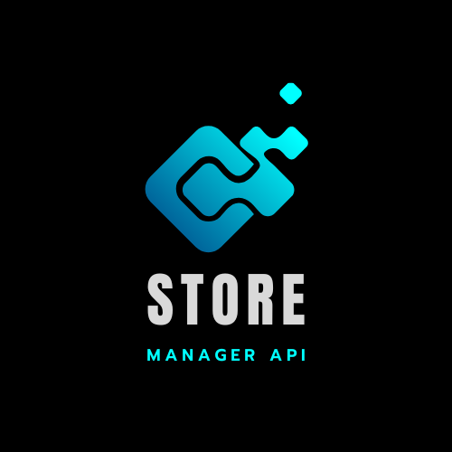
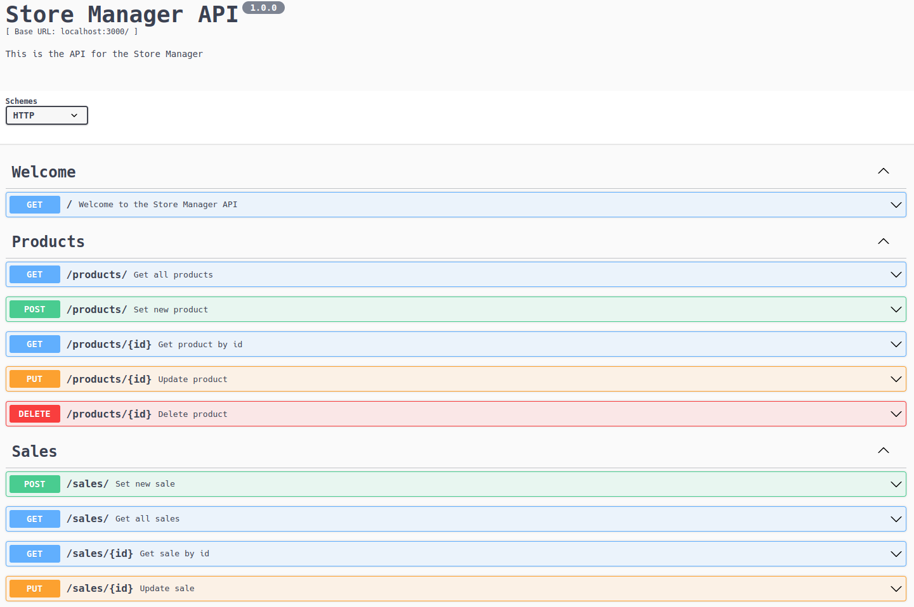

<div align="center">
  
</div>

---

## :memo: Descrição do Projeto

<p align="center">Este projeto consiste em uma API de uma loja. Ela foi criada usando o Express.js. Nela, produtos e vendas podem ser criados, listados, atualizados e excluídos.</p>

## 📋 Tabela de conteúdos

<!--ts-->

- [🎯 Objetivo do projeto](#🎯-objetivo-do-projeto)
- [📝 O que pratiquei](#📝-o-que-pratiquei)
- [🛠 Tecnologias utilizadas](#🛠-tecnologias-utilizadas)
- [🚀 Rodando o projeto na sua máquina](#🚀-rodando-o-projeto-na-sua-máquina)
  - [📍Pre Requisitos](#📍-pre-requisitos)
- [📚 Documentação da API](#📚-documentação-da-api)
- [👉🏾 Status do projeto](#👉🏾-status-do-projeto)
- [🔗 Link para acessar o projeto](#🔗-link-para-acessar-o-projeto)
- [🤝 Colaboradores](#🤝-colaboradores)

<!--te-->

## 🎯 Objetivo do projeto

Neste projeto de cunho educacional, foi desenvolvida uma API para um sistema de gerenciamento de vendas dropshipping que permite a criação, visualização, exclusão e atualização de itens e vendas.

Este projeto é uma API [RESTful](https://aws.amazon.com/pt/what-is/restful-api/), ou seja, utiliza o padrão REST, e possui arquitetura MSC (model-service-controller)!

O projeto usa o banco de dados MySQL para gerenciamento de dados.

## 📝 O que pratiquei

Neste projeto, foi possível testar as habilidades:

- Utilizar o `Node.js` com o framework Express para criar uma rota de um endpoint de API, acessível pelo navegador;
- Utilizar o Nodemon para auxiliar no desenvolvimento de APIs `Node.js` com o framework Express;
- Utilizar o `Node.js` com o framework Express para receber e tratar requisições com parâmetros em seu corpo, ou body;
- Aplicar a arquitetura baseada em camadas em um código de exemplo;
  - Arquitetura de Software MSC (Model, Service e Controller);
- Criar testes de unidade para componentes de software da camada Model, Service, Controller;
- Identificar e interpretar as regras de negócios de uma aplicação;
- Compreender as responsabilidades da camada Services da arquitetura MSC;

## 🛠 Tecnologias utilizadas

As seguintes ferramentas foram usadas na construção do projeto:

- [Express](https://expressjs.com/pt-br/)
- [Nodemon](https://www.npmjs.com/package/nodemon)
- [Joi](https://joi.dev/)
- [mysql2](https://www.npmjs.com/package/mysql2)

Para os testes:

- [jest](https://jestjs.io/pt-BR/)
- [mocha](https://mochajs.org/)
- [chai](https://www.chaijs.com/)
- [sinon](https://sinonjs.org/)
- [sinon-chai](https://www.npmjs.com/package/sinon-chai)

Para documentação da API:

- [swagger-ui-express](https://www.npmjs.com/package/swagger-ui-express)
- [swagger-autogen](https://www.npmjs.com/package/swagger-autogen)

As seguintes bibliotecas foram utilizadas para documentação do projeto:

- [swagger-ui-express](https://www.npmjs.com/package/swagger-ui-express)
- [swagger-autogen](https://www.npmjs.com/package/swagger-autogen)

## 🚀 Rodando o projeto na sua máquina

Para rodar o projeto na sua máquina é necessário alguns pre requisitos:

### 📍Pre Requisitos

Antes de começar, você vai precisar ter instalado em sua máquina as seguintes ferramentas:
[Git](https://git-scm.com), [Node.js](https://nodejs.org/en/).

Além disto é bom ter um editor para trabalhar com o código como [VSCode](https://code.visualstudio.com/)!

Comandos para clonar o projeto na sua máquina:

```bash
# Clone este repositório com o comando:
git clone git@github.com:raphaelprsilva/store-manager.git

# Acesse a pasta do projeto no terminal/cmd com o comando:
cd store-manager

# Instale as dependências com o comando:
npm install

# Inicie a aplicação com o comando:
npm run debug

```

#### Diagrama de Entidade-Relacionamento

Para orientar a manipulação das tabelas, utilize o DER a seguir:


#### Scripts que podem te ajudar

- Criar o banco de dados e gerar as tabelas:

```sh
  npm run migration
```

- Limpar e popular o banco de dados:

```sh
  npm run seed
```

- Iniciar o servidor Node:

```sh
  npm start
```

- Iniciar o servidor Node com nodemon:

```sh
  npm run debug
```

- Executar os testes de unidade da API:

```sh
  npm run test:mocha
```

- Executar o linter:

```sh
  npm run lint
```

O projeto possui um arquivo `docker-compose.yaml`, ou seja, você pode rodar o projeto com o Docker. Então caso você opte por:

### Rodar o projeto com o Docker

> Rode o serviço `node` com o comando `docker-compose up -d`.

- Esse serviço irá inicializar um container chamado `talker_manager`.
- A partir daqui você pode rodar o container via CLI ou abri-lo no VS Code.

> Use o comando `docker exec -it talker_manager bash`.

- Ele te dará acesso ao terminal interativo do container criado pelo compose, que está rodando em segundo plano.

> Instale as dependências [**Caso existam**] com `npm install`

A extensão `Remote - Containers` do VS Code (que estará na seção de extensões recomendadas do programa) é indicada para que você possa desenvolver sua aplicação no container Docker direto no VS Code, como você faz com seus arquivos locais.


## 📚 Documentação da API

Para ver a documentação da API no Swagger com todas as funcionalidades da mesma, basta:

1. Colocar a aplicação para rodar com o comando:

```bash
npm run dev
```

2. No seu navegador, insira a rota:
   - http://localhost:3000/api-doc

Ao acessar a rota acima, você verá a imagem da página da documentação.



## 👉🏾 Status do projeto

Como melhoria, faltaria apenas fazer o deploy da API.

- [ ] Fazer o deploy da API

## 🔗 Link para acessar o projeto

Se quiser ao invés de clonar o projeto e rodar localmente, você deseje ver o mesmo online, basta clicar no link abaixo:

<a href="" target="_blank" rel="noopener">Store Manager API</a>

## 🤝 Colaboradores

<table>
  <tr>
    <td align="center">
      <a href="http://github.com/raphaelprsilva">
        <br>
        <sub>
          <b>raphaelprsilva</b>
        </sub>
      </a>
    </td>
  </tr>
</table>
